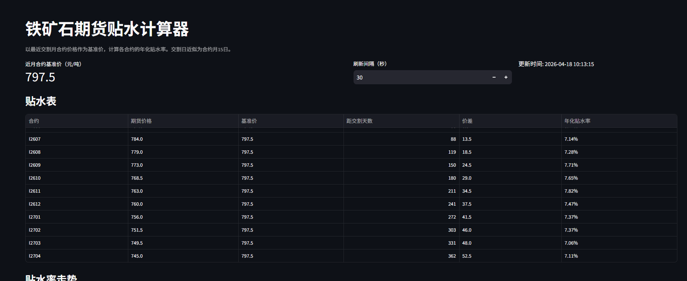
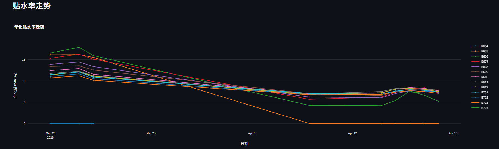
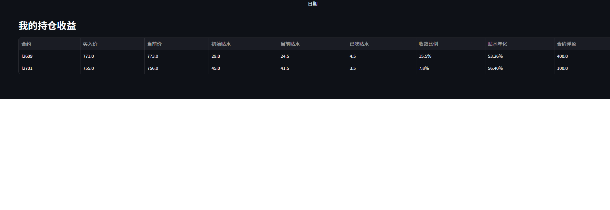

# 铁矿石期货贴水计算器

基于 Streamlit 的 DCE 铁矿石期货年化贴水率计算工具。以最近交割月合约价格作为基准价，实时计算各合约的年化贴水率，支持持仓收益追踪和企业微信推送。

## 功能

- **实时贴水表** — 获取所有活跃合约报价，计算价差与年化贴水率，按交割日排序
- **走势图表** — 基于 Plotly 的历史年化贴水率趋势图，数据自动累积
- **持仓追踪** — 从 Excel 导入持仓记录，实时计算已吃贴水、收敛比例、年化收益
- **企业微信推送** — 每个交易日开盘后自动发送贴水日报 + 持仓收益摘要
- **交易时段自动刷新** — DCE 交易时间内（9:00–15:00, 21:00–23:00）自动轮询更新

## 界面截图

### 实时贴水表

展示所有活跃合约的报价、价差、年化贴水率，按交割日从近到远排序。以最近交割月合约价格作为基准价。



### 贴水率走势图

基于 Plotly 的交互式趋势图，展示各合约历史年化贴水率的变化。数据随每日自动累积，存储在本地 SQLite 中。



### 持仓收益追踪

从 Excel 导入持仓记录后，实时计算每笔持仓的已吃贴水、收敛比例和年化收益。



## 数据流

```
AKShare API → src/data_fetcher.py → src/calculator.py → src/app.py (展示) + src/storage.py (SQLite)
                                                         → src/notify.py (企业微信推送)
```

## 项目结构

```
├── src/                # 源代码
│   ├── app.py          # Streamlit 主页面
│   ├── calculator.py   # 年化贴水率纯函数计算
│   ├── data_fetcher.py # AKShare 数据获取隔离层
│   ├── storage.py      # SQLite 历史数据持久化
│   ├── position.py     # 持仓管理（Excel 读写 + 收益计算）
│   └── notify.py       # 企业微信 Webhook 推送
├── requirements.txt    # Python 依赖
├── data/               # SQLite 数据库（自动创建）
├── tests/              # 单元测试
└── .github/workflows/daily-basis.yml  # 每日定时推送
```

## 快速开始

### 安装依赖

```bash
pip install -r requirements.txt
```

### 启动应用

```bash
streamlit run src/app.py
```

默认运行在 `http://localhost:8501`。

### 运行测试

```bash
pytest tests/ -v
```

## 持仓追踪

在 `data/positions.xlsx` 中维护持仓记录，表头格式：

| 合约 | 买入日期 | 买入价格 | 买入时基准价 | 是否已卖出 | 吃到贴水 |
|------|---------|---------|------------|----------|---------|
| I2509 | 2025-01-15 | 780.0 | 820.0 | N | |

- 已卖出标记为 `Y` 的持仓，系统会自动冻结其"吃到贴水"值
- 未平仓持仓在页面底部实时展示收益

## 企业微信推送

通过 GitHub Actions 每个交易日 09:30（北京时间）自动运行：

1. 在仓库 Settings → Secrets 中添加 `WECHAT_WEBHOOK_URL`
2. Actions 会在工作日自动执行，也可手动触发

## 关键说明

- **基准价**：使用最近交割月合约价格，非外部现货价
- **交割日**：近似为合约月 15 日（实际为交割月第 10 个交易日）
- **AKShare 版本**：API 可能随版本变化，`src/data_fetcher.py` 作为隔离层便于维护

## 技术栈

- Python 3.12+
- [Streamlit](https://streamlit.io/) — Web UI
- [AKShare](https://github.com/akfamily/akshare) — 期货行情数据
- [Plotly](https://plotly.com/python/) — 交互式图表
- SQLite — 历史数据存储
- GitHub Actions — 定时推送
